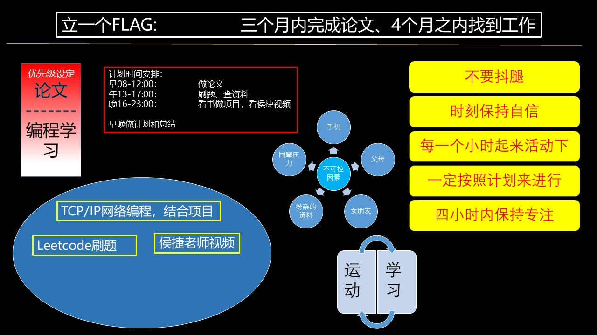

# 前言

从山顶到谷底，我也仅仅用了不到3年的时间，由于研一的退学和研二的培训结构经历的失败，导致了我缺乏时间管理意识，研三阶段已经开始放飞自我，两年里囫囵吞枣的学了很多的东西，但是都以失败告终，这导致了我实习失败，论文失败，毕业失败，心态崩溃，成为了一个loseer！

从小到大一路走来，我都是给人以好学生的姿态，至少在此之前从来都不接受自己变得不优秀的事实，但是研一和研二的两次决定都验证了：我，不优秀且蠢。我想这发生一切都应该不是偶然，肯定是自己自卑加社恐的性格弱点在作怪，要说之前没有显现出来是因为我按部就班，没有给他可乘之机。都说大学是个小社会，读研更甚，那么这方面的劣势就导致了不可挽回的。

分析下导致我失败的研究生阶段的原因：

- 主观原因：
  - 自卑、社恐的心理。不自信使得我错过了一些原本争取到的机会，如牛逼的导师，不错的实习机会。而社恐使得我在与导师的交流过程中信息的不对称，我一年换了三个科研方向。
  - 缺乏自律。我喜欢去做计划，但是在计划执行中总是被外界影响，比如实习期间我竟然选择了去参加培训，而培训的结果并不理想。
- 客观原因：
  - 首先就是疫情影响直接导致了我论文难以完成。
  - 另一方面是来自于父母的不理解和女朋友的压力过大。
  - 所处的环境不好，学院对我们的态度就是任自生自灭。

今年对于我来说很重要，因为疫情的原因我有很长的时间来反思自己的生活。这半年多的时间里面，我不仅接受了延毕的现实，也调整好自己的情绪，这半年的思考也让我不再逃避，当所有的挫折都是未来给自己的“入社”考试，古人云“知耻而后勇”，现在我想重新出发，借用小马哥的话说就是“不是为了证明自己有多了不起，而是我失去的东西我一定要拿回来”。

我明白发生的一切都不能改变，能做的就是改变未来。

这是我初步进行的计划，制定的思路是在有限的时间内多做点事。

# 数据结构与算法

- [Leetcode网站刷题](https://leetcode-cn.com/problemset/lcof/)
- [个人整理笔记](./leetcode_solution/)

# 项目展示

- project 1
- project 2

# 科研项目

- 做了什么

# 关于运动减肥

- [减肥计划](https://cxpeng.cn/archives/494fcdcb.html)
- [阶段总结1](https://cxpeng.cn/archives/63888f54.html)
- [阶段总结2](https://cxpeng.cn/archives/713d20ba.html)

