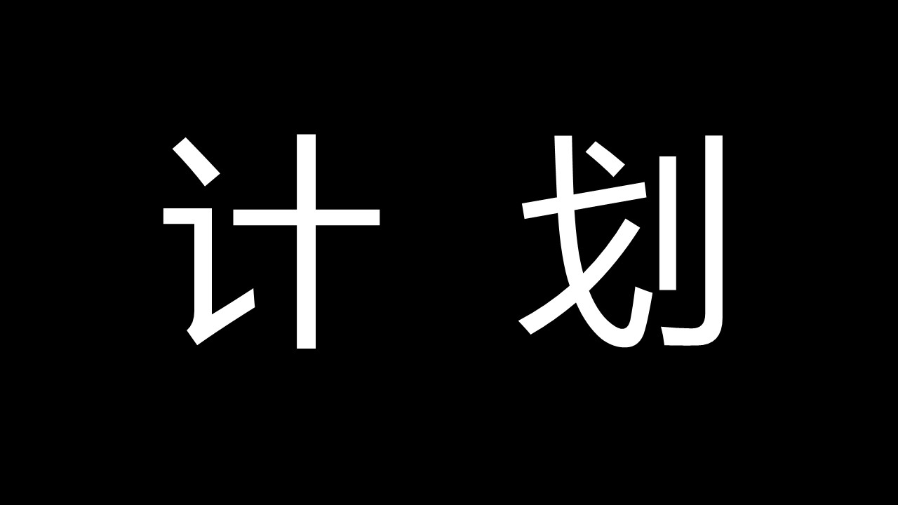

# 前言

从山顶到谷底，我也仅仅用了不到3年的时间，现在我想重新出发，借用小马哥的话说就是“不是为了证明自己有多了不起，而是我失去的东西我一定要拿回来”。
由于研一的退学和研二的培训结构经历的失败，导致了我缺乏时间管理意识，研三阶段已经是放飞自我，期间虽然是囫囵吞枣的学了很多的东西，但是都以失败告终。导致了实习失败，论文失败，毕业失败，心态崩溃。

从小到大一路走来，我都是给人以好学生的姿态，至少在此之前从来都不接受自己变得不优秀的事实，但是研一和研二的两次决定都验证了：我，不优秀且蠢。我想这发生一切都应该不是偶然，肯定是自己自卑加社恐的性格弱点在作怪，要说之前没有显现出来是因为我按部就班，没有给他可乘之机。而如今的我更加接近社会，这方面的劣势就会导致不可挽回的打击。今年对于我来说很重要，因为疫情的原因我有很长的时间来反思自己的一切。利用这段时间，我不仅接受了延毕的现实，也调整好了心态，古人云“知耻而后勇”，这半年的思考也让我开始直面我的人生，不再逃避。就当是给自己的“入社”考试，未来一年就是我书写答卷的阶段。

